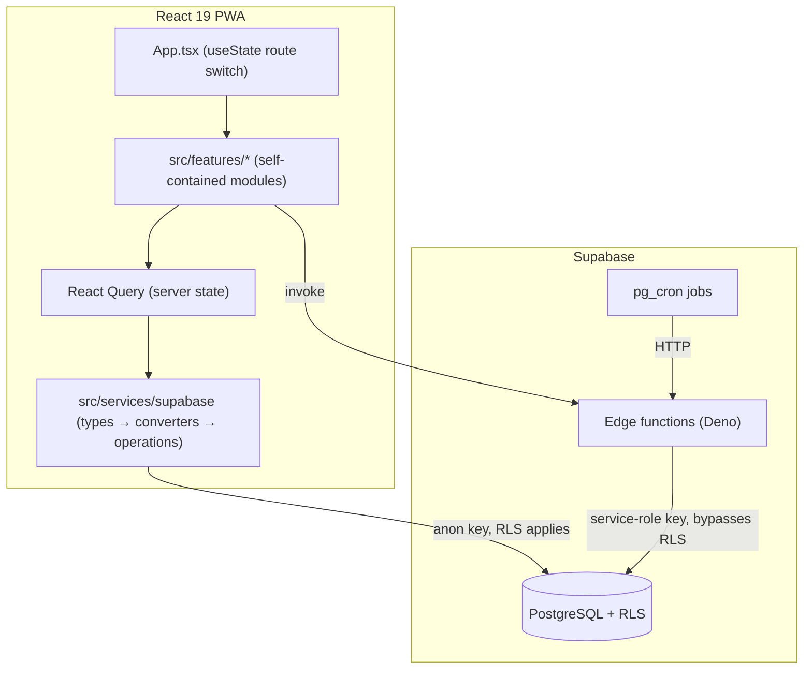

# Buddy — Design & Status

Living overview of the Student Buddy app: what it is, how it's structured, and what's done vs planned. Updated by `/finish-part` as parts complete. (Architecture deep-dives live in `docs/reference/ARCHITECTURE_PLAN.md` and per-feature pages indexed below; see `docs/README.md` for the full docs map.)

## Overview

Student Buddy — a PWA for executive function, self-regulation, and holistic life tracking. React 19 + TypeScript (strict) + Vite, Tailwind CSS, Supabase (PostgreSQL + edge functions), deployed on Netlify. Local-first, offline-capable.

## Architecture

Key conventions live in `CLAUDE.md` (naming gotchas, 3-layer data pattern, edge-function rules). Read it before changing data or DB code.

## Status

### ✅ Done
- **tasks** — todos with prioritization, task types/routines, smart notes, per-task reminders, task kinds.
- **health-tracking** — custom metric tracking, correlations, protocols, experiments.
- **planning** — time-blocking calendar + daily reflection.
- **day** — morning/midday/today daily routine views, close-day flow.
- **growth** — skills + skill logs.
- **school** — classes, assignments, class sessions, documents.
- **assistant** — AI chat with slash commands, tool registry, rule engine, HR/trainer agents.
- **checklists / toolbox / focus / notifications / browse / me / core** — supporting modules.
- **notifications** — push subscriptions, per-day scheduling, quiet hours, rate limiting.
- **Google Calendar** — auth + write (recent).

### 🚧 In progress
- _(none recorded — add via `/start-part`)_

### 📋 Planned / not done
- _(track upcoming work here; `/finish-part` moves items to Done)_

## Changelog

<!-- newest first; one dated entry per finished part -->
- 2026-06-19 — Added Claude Code developer tooling: project agents, slash commands, advisory hooks, Prettier + husky, and this progress-journal + design-doc workflow.

## Feature docs index

<!-- per-feature deep-dive pages generated by /finish-part for significant parts -->
- _(none yet)_
