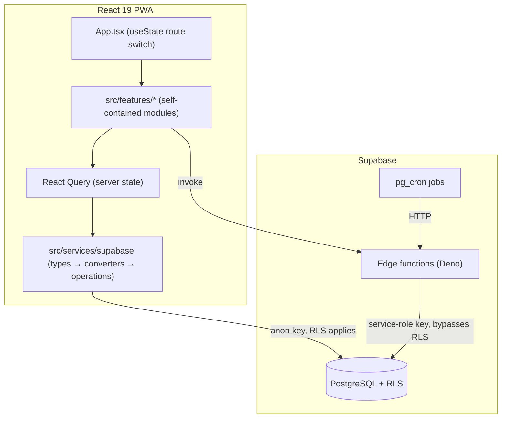

# Buddy — Design & Status

Living overview of the Student Buddy app: what it is, how it is structured, and what is currently shipped. Updated as significant parts complete.

## Overview

Student Buddy — a PWA for executive function, self-regulation, and holistic life tracking. React 19 + TypeScript (strict) + Vite, Tailwind CSS, Supabase (PostgreSQL + edge functions), deployed on Netlify. Local-first, offline-capable.

## Architecture

Key conventions live in `CLAUDE.md` (naming gotchas, 3-layer data pattern, edge-function rules). Read it before changing data or DB code.

## Status

### ✅ Done
- **tasks** — todos with one canonical deterministic ordering, task types/routines, smart notes, per-task reminders, task kinds (incl. derived-only `school`), a capture-triage pipeline (self-sorting captured tasks → urgent/today/someday/school/routine with AI auto-routing, confidence split, learning doc, AI-inferred task type/energy/estimate), stuck-signal detection (snooze counting + staleness → on-card split), quick-wins filter, and 30-day completed fade. See [tasks.md](tasks.md).
- **three-touch day** — deterministic morning pick (2–3 small tasks, soft cap, no AI dependency), reduced Now page (picks + capture + evening close-day CTA), school assignments auto-mirroring onto linked todos with bidirectional completion, survival-day mode (1 pick, non-anchor notifications deferred), non-imperative anchor copy + `step` deep link.
- **health-tracking** — custom metric tracking, correlations, protocols, experiments.
- **planning** — time-blocking calendar + daily reflection.
- **day** — morning/midday/today daily routine views, close-day flow.
- **growth** — skills + skill logs.
- **school** — classes, assignments, class sessions, documents.
- **assistant** — AI chat with slash commands, tool registry, rule engine, HR/trainer agents.
- **checklists / toolbox / focus / notifications / browse / me / core** — supporting modules.
- **notifications** — push subscriptions, per-day scheduling, quiet hours, rate limiting.
- **Google Calendar** — auth + write (recent).

### 🚧 In progress
- _(none recorded — add via `/start-part`)_

### 📋 Planned / not done
- _(track upcoming work here; `/finish-part` moves items to Done)_

## Changelog

<!-- newest first; one dated entry per finished part -->
- 2026-07-05 — **tasks-sorting** part: 13 bug fixes + unified sorting + smarter categories. Timezone-safe due-date parsing (`utils/dueDates.ts`, noon anchor) everywhere; one triage write path (`services/taskWrites.ts` `persistTaskUpdate` + `services/applyTriage.ts` — eager, auto-apply, and manual triage now byte-identical, eager triage routes school and runs from `addTaskFull` too); unified snooze counting (`nextSnoozeCount`); truthful inbox (shared selectors, failed auto-applies reappear); completed list sorted by completion time + working Done chip; AI splitter's learning prompt actually sent. One canonical order (`utils/taskOrdering.ts`; urgent weight 120, staleness +15, backlog aging) across all three views + "Why" hint on the top pick. Derived-only `school` kind (never written to the DB column), deadline kind reachable without a reminder, triage AI also infers task type (validated) with gap-fill-only writes, EN+NL capture keywords. Quick-wins chip; completed >30d fade out of the query. See [tasks.md](tasks.md).
- 2026-07-04 — **three-touch-day** part: rebuilt the daily loop around a small morning pick, capture, and evening close. Assignments now mirror to todos; the app adds stuck-task signals, a one-pick survival-day mode, and step-specific notification deep links.
- 2026-06-28 — **tasks** part: capture-triage pipeline. Triage router (manual + AI) routes the capture inbox to urgent/today/someday/school/routine, then self-sorting capture (auto-apply confident routes at capture, "I sorted these" review, hardness `fixed`/`flexible`, one-a-day someday card, loose-school surfacing). New `todos` columns `triaged_at`/`hardness`/`auto_triaged`/`triage_destination` (migrations `20260621000000`, `20260621010000`); `settings.triage_learnings` learning doc. See [tasks.md](tasks.md).
- 2026-06-19 — Added Claude Code developer tooling: project agents, slash commands, advisory hooks, Prettier + husky, and this progress-journal + design-doc workflow.

## Feature docs index

<!-- per-feature deep-dive pages generated by /finish-part for significant parts -->
- [tasks.md](tasks.md) — Tasks & capture-triage pipeline (data model, routing, AI self-sorting flow). Diagram: [diagrams/tasks-triage.md](diagrams/tasks-triage.md).
