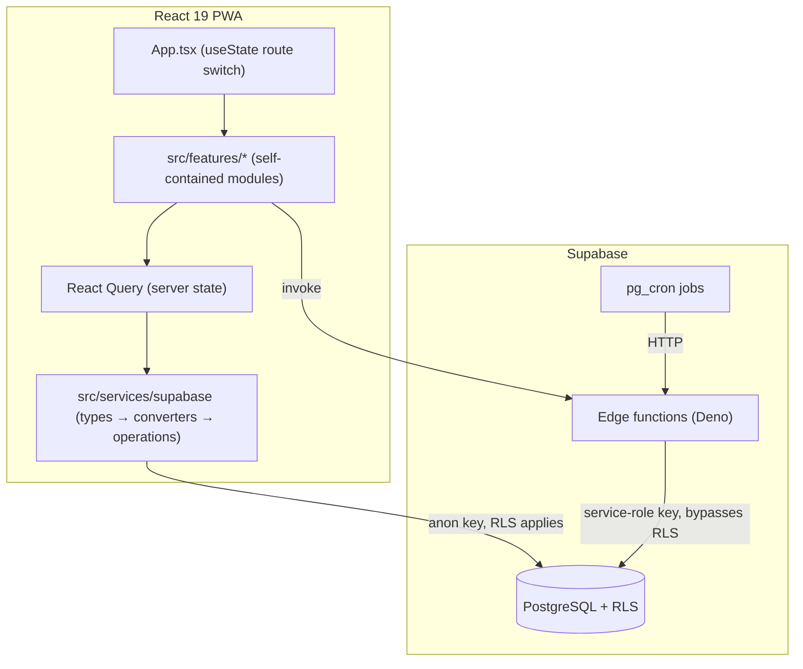

# Buddy — Design & Status

Living overview of the Student Buddy app: what it is, how it is structured, and what is currently shipped. Updated as significant parts complete.

## Overview

Student Buddy — a PWA for executive function, self-regulation, and holistic life tracking. React 19 + TypeScript (strict) + Vite, Tailwind CSS, Supabase (PostgreSQL + edge functions), deployed on Netlify. Local-first, offline-capable.

## Architecture

```mermaid
graph TD
  subgraph Client["React 19 PWA"]
    App["App.tsx (useState route switch)"]
    Features["src/features/* (self-contained modules)"]
    RQ["React Query (server state)"]
    SvcLayer["src/services/supabase (types → converters → operations)"]
    App --> Features --> RQ --> SvcLayer
  end

  subgraph Supabase
    DB[("PostgreSQL + RLS")]
    Edge["Edge functions (Deno)"]
    Cron["pg_cron jobs"]
  end

  SvcLayer -->|anon key, RLS applies| DB
  Features -->|invoke| Edge
  Edge -->|service-role key, bypasses RLS| DB
  Cron -->|HTTP| Edge
```

Key conventions live in `CLAUDE.md` (naming gotchas, 3-layer data pattern, edge-function rules). Read it before changing data or DB code.

## Status

### ✅ Done
- **tasks** — todos with one canonical deterministic ordering, task types/routines, per-task reminders, the seven-value `flag` classification, a capture-triage pipeline (self-sorting captured tasks with AI auto-routing, confidence split, learning doc, skip/undo, AI-inferred task type/energy/estimate), a recommender that shows its reasons on the top pick, stuck-signal detection (snooze counting + staleness) surfacing a **one-tap split at the point of avoidance**, subtasks with an AI splitter, deadline start dates with a slipped-start warning, quick-wins filter, and 30-day completed fade. See [tasks.md](tasks.md).
- **three-touch day** — deterministic morning pick (2–3 small tasks, soft cap, no AI dependency) that the user can **swap or decline in the gate**, reduced Now page (picks + capture + a pick sheet for adding one + evening close-day CTA), school assignments auto-mirroring onto linked todos with bidirectional completion **and their own reminders**, survival-day mode (1 pick, non-anchor notifications deferred), non-imperative anchor copy, and notification buttons that all do what they say (complete / snooze / close-day deep links).
- **health-tracking** — custom metric tracking, correlations, protocols, experiments.
- **planning** — time-blocking calendar + daily reflection.
- **day** — morning/midday/today daily routine views, close-day flow.
- **growth** — skills + skill logs.
- **school** — classes, assignments, class sessions, documents.
- **assistant** — AI chat with slash commands, tool registry, rule engine, HR/trainer agents.
- **checklists / toolbox / focus / notifications / browse / me / core** — supporting modules.
- **Cove consistency** — every live surface reads from the Cove tokens; `src/**` is at zero default-palette hits and the `app-*` primitive layer is the sanctioned class set. Notes retired: **Capture is the single inbox**.
- **notifications** — push subscriptions, per-day scheduling, quiet hours, rate limiting.
- **Google Calendar** — auth + write (recent).
- **Buddy Cove redesign** — full UI replacement: whale mascot, once-per-day morning check-in gate, Now (max-3 picks + midday reset + folded stats), one-at-a-time triage Tasks page, Capture dump box, close-day overlay with leftover resolution + derived streak, Browse grid, Me page; all legacy pages retherned (Nunito + cove tokens). See [cove.md](cove.md).

### 🚧 In progress
- _(none recorded — add via `/start-part`)_

### 📋 Planned / not done
- **Google Calendar task scheduling — unfinished, and it must be finished before
  this counts as MVP-complete.** The auth and write edge functions exist and are
  wired into every task write path, but three gates keep the feature dormant and
  it has never once pushed an event: `VITE_GOOGLE_OAUTH_CLIENT_ID` is not set on
  Netlify, the `GOOGLE_OAUTH_CLIENT_ID` / `GOOGLE_OAUTH_CLIENT_SECRET` edge
  secrets were never confirmed, and the push predicate (flag `urgent` **and** a
  planned day **and** a `dueTime`) is narrow enough that no real task has matched
  it. Deciding *which* tasks belong on the calendar is the design question;
  `components/UrgentScheduleModal.tsx` is kept unrendered as the only surviving
  implementation of that flow.
  > ⚠️ **Rotate the secret first.** The Google OAuth client secret was pasted
  > into a chat once. Rotate it in the Google Cloud Console and update the edge
  > secret **before** any production exposure.
- **Focus-timer ↔ task linking** — deliberately deferred. The dead `startTask` /
  `completeTaskWithDuration` paths that half-implemented it were removed in the
  2026-08-20 part (the latter skipped every completion side-effect, so it was a
  trap rather than a head start). `todos.started_at` / `actual_minutes` remain.
- **Energy/context ranking bonuses** — the recommender can weight a task against
  how the user feels, but there is no "today's energy" signal to weight against:
  the morning gate records *yesterday's* mood and energy.
- **Someday review + routine decisions** — `utils/taskContracts.ts` implements
  and tests `isSomedayReviewEligible` / `pickSomedayReview` /
  `missedRoutineOccurrences` / `needsRoutineDecision`; no UI has been designed
  for either prompt.
- **Close-day UI consolidation** — `CloseDayCard` still lives inside
  `ReflectionPage` alongside the Now-page `CloseDayOverlay`. The night-anchor
  path into the card was removed, so the duplication is now cosmetic.

## Changelog

<!-- newest first; one dated entry per finished part -->
- 2026-08-17 — **audit + cove-consistency** part: a live pass over every tab, driving the real app against the live database, then fixing what it found. **The app could not be scrolled**: `main` declared itself a scroll container while sitting `flex-1` in a `min-h-dvh` column, so it grew to full content height, never scrolled, and Chrome swallowed every wheel event instead of chaining to the document — measured 0px of movement over the app vs 500px over the backdrop beside it. That put Health's "Save check-in" permanently out of reach. **Viewport breakpoints inside the 520px shell** were one root cause behind four separate "broken layout" reports (Assistant, School, Calendar, Toolbox, tile grids): Tailwind's `md:`/`lg:` key off the viewport, so desktop layouts activated in a phone-width column. **The assistant scored recovered retries as failures** (`steps.every(success)`), rendering "OK, I logged 7 hours of sleep for you" in a red error card over a write that had succeeded; and the check-in tool refused the model's own arguments (`Number("7 hours")` is `NaN`), costing up to four tool calls per log — now one. Also: all-day calendar events no longer render a fake "00:00" or collapse to a single day; tracker values are range-checked at the boundary (77 hours of sleep had been stored silently); Health history is paged (12,224px → 6,383px); task and check-in saves confirm; the disabled Save jumps to the first missing field. Finished the **Cove palette sweep** (167 swaps, `src/**` now at zero legacy-palette hits) and **retired the Notes surface** — 0 writes in 90 days, so Capture becomes the single inbox; the 3 inbox notes migrated to `todos`, the 20 categorised rows kept as archive, and `notes.tool.ts` deleted rather than left writing rows nothing could read. Deferred by decision: the class-session `01:30` question (real data or a UTC-into-naive-`time` import bug) needs the user's answer. 45 new tests; 529 passing.
- 2026-08-16 — **task-system-collapse** part: acted on a full audit of the task feature. **Deleted ~48 unreachable modules** — the Cove redesign had orphaned every `core/` home card and the whole `day/` morning+midday system, and the legacy `TodoPage` tree went once its contents were harvested; added `npm run check:reach` (advisory in the Stop hook) so it cannot recur. **Collapsed three vocabularies into one**: `kind` and `triage_destination` dropped (migration `20260816000001`, along with never-used `labels`/`project_id`/`historical_minutes`), `flag` now NOT NULL with a single `TASK_FLAG_META`/`TASK_FLAG_ORDER`; urgency derives from the flag, not `priority`. **Two write paths** (`insertTask`/`insertTasks` + `persistTaskUpdate`) replace four hand-rolled inserts — fixing recurring tasks going silent after their first occurrence. The **assistant edge function stops classifying**, so iPhone Shortcut captures finally enter triage. New **two-tier Tasks screen** (`buildTaskBoard`: ranked "Needs you now" + a folded section per flag, every task appearing exactly once), a **mobile task editor** (`TaskDetailSheet`), all 7 triage destinations reachable, and a **correction loop that records why** (reason chips → `triage_learnings`). Canonical reference is now [`src/features/tasks/README.md`](../src/features/tasks/README.md). Deferred by decision: subtasks, `start_date`, Google Calendar. See [tasks.md](tasks.md).
- 2026-07-16 — **buddy-cove-redesign** part: complete UI replacement per the `design_handoff_buddy_cove/` handoff (branch `redesign/buddy-cove`). New `src/features/cove/` module: morning check-in gate blocking every route once per day (`daily_plans.checked_in_at/checkin_skipped/intention`, migration `20260716000001_checkin_gate`, first writer for `mood_at_plan_time`/`energy_at_plan_time` via a tested 1–10 `moodScale`), Now page (whale + speech bubble, streak/done/intention chips, midday reset card, confetti pick cards, folded routine/week/stats), close-day overlay (explicit leftover resolution → reflection → celebration; streak **derived** from consecutive `closed_at` days), one-at-a-time triage Tasks page (legacy TodoPage behind "⋯ tools"), Capture dump box (new `capture` route; assistant chat demoted to Me → advanced). 520px phone-first shell + 5-tab badge-free nav (no sidebar/FAB — voice capture retired); self-hosted Nunito; cove tokens retheme all legacy pages, Health leads with check-in+trends and folds analysis behind "Explore my data". HomePage/DayPage/CaptureFAB deleted; `today` deep-links land on Now. See [cove.md](cove.md).
- 2026-07-05 — **tasks-sorting** part: 13 bug fixes + unified sorting + smarter categories. Timezone-safe due-date parsing (`utils/dueDates.ts`, noon anchor) everywhere; one triage write path (`services/taskWrites.ts` `persistTaskUpdate` + `services/applyTriage.ts` — eager, auto-apply, and manual triage now byte-identical, eager triage routes school and runs from `addTaskFull` too); unified snooze counting (`nextSnoozeCount`); truthful inbox (shared selectors, failed auto-applies reappear); completed list sorted by completion time + working Done chip; AI splitter's learning prompt actually sent. One canonical order (`utils/taskOrdering.ts`; urgent weight 120, staleness +15, backlog aging) across all three views + "Why" hint on the top pick. Derived-only `school` kind (never written to the DB column), deadline kind reachable without a reminder, triage AI also infers task type (validated) with gap-fill-only writes, EN+NL capture keywords. Quick-wins chip; completed >30d fade out of the query. See [tasks.md](tasks.md).
- 2026-07-04 — **three-touch-day** part: rebuilt the daily loop around a small morning pick, capture, and evening close. Assignments now mirror to todos; the app adds stuck-task signals, a one-pick survival-day mode, and step-specific notification deep links.
- 2026-06-28 — **tasks** part: capture-triage pipeline. Triage router (manual + AI) routes the capture inbox to urgent/today/someday/school/routine, then self-sorting capture (auto-apply confident routes at capture, "I sorted these" review, hardness `fixed`/`flexible`, one-a-day someday card, loose-school surfacing). New `todos` columns `triaged_at`/`hardness`/`auto_triaged`/`triage_destination` (migrations `20260621000000`, `20260621010000`); `settings.triage_learnings` learning doc. See [tasks.md](tasks.md).
- 2026-06-19 — Added Claude Code developer tooling: project agents, slash commands, advisory hooks, Prettier + husky, and this progress-journal + design-doc workflow.

## Feature docs index

<!-- per-feature deep-dive pages generated by /finish-part for significant parts -->
- [tasks.md](tasks.md) — Tasks map. **Canonical reference: [src/features/tasks/README.md](../src/features/tasks/README.md)** (flags, write paths, learning loop, deferred features). Diagram: [diagrams/tasks-triage.md](diagrams/tasks-triage.md).
- [cove.md](cove.md) — Buddy Cove UI (daily loop: gate → Now → close-day; tokens; screen map; state; **shell scroll + breakpoint invariants**; Capture as the only inbox). Diagrams: [diagrams/cove.md](diagrams/cove.md), [diagrams/app-shell.md](diagrams/app-shell.md).
