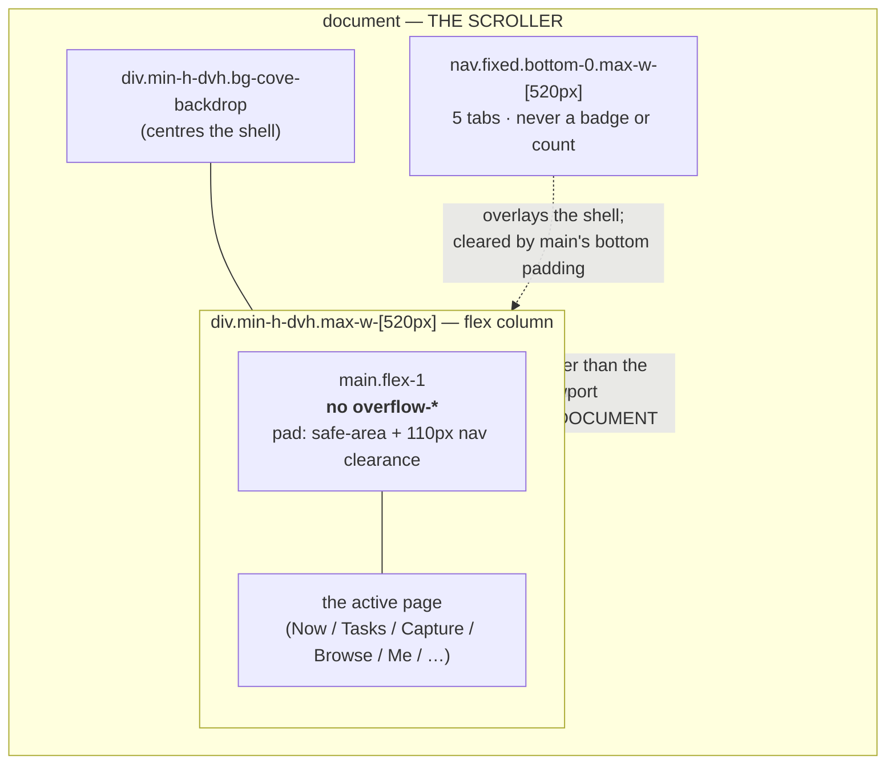
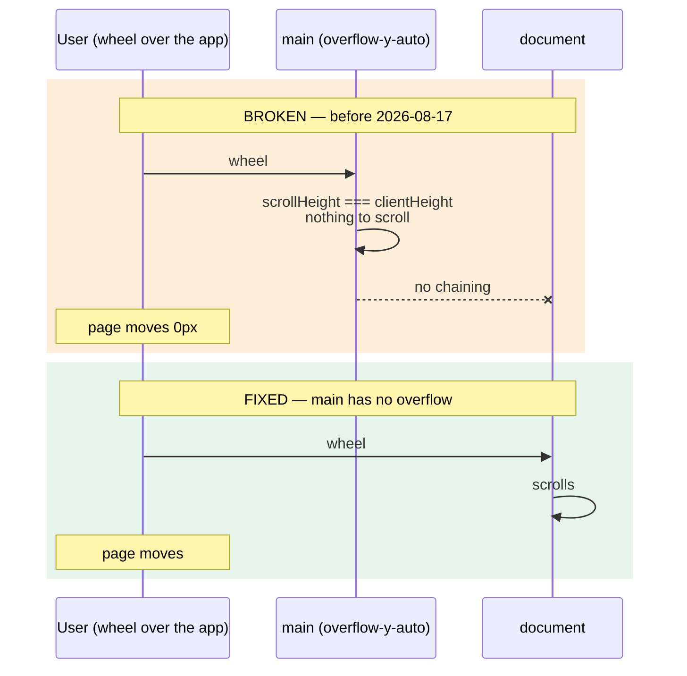
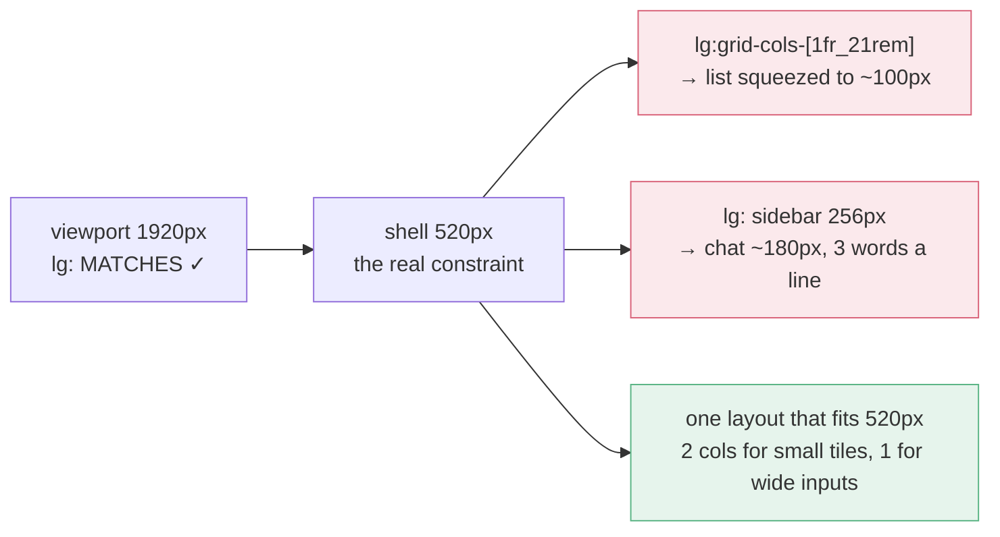

# App shell — layout and scroll

Two invariants that are easy to break silently, both learned the hard way on 2026-08-17.

## Structure

## Why `main` must not be a scroll container

`main` is `flex-1` inside a `min-h-dvh` (auto-height) column, so it always grows to the full
content height and can never scroll itself. Declaring it `overflow-y-auto` anyway made Chrome
treat it as the wheel target and **swallow every wheel event over the app** rather than chaining
to the document.

Symptom to recognise: the page scrolls when the cursor sits on the backdrop *beside* the shell,
but not when it sits on the content. Measured before the fix — 0px inside, 500px outside.

## Why viewport breakpoints don't work in here

The shell is capped at `max-w-[520px]`, but Tailwind's `sm:` / `md:` / `lg:` key off the
**viewport**. On a desktop browser the viewport is ~1920px, so every desktop layout activated
inside a 520px column.

**Rule:** no viewport breakpoint for layout inside the shell. They remain valid in surfaces that
render *outside* it — `Modal`, `Toast`, `LoginScreen`, `CheckInGate`, `CloseDayOverlay` — because
those really are viewport-sized.
