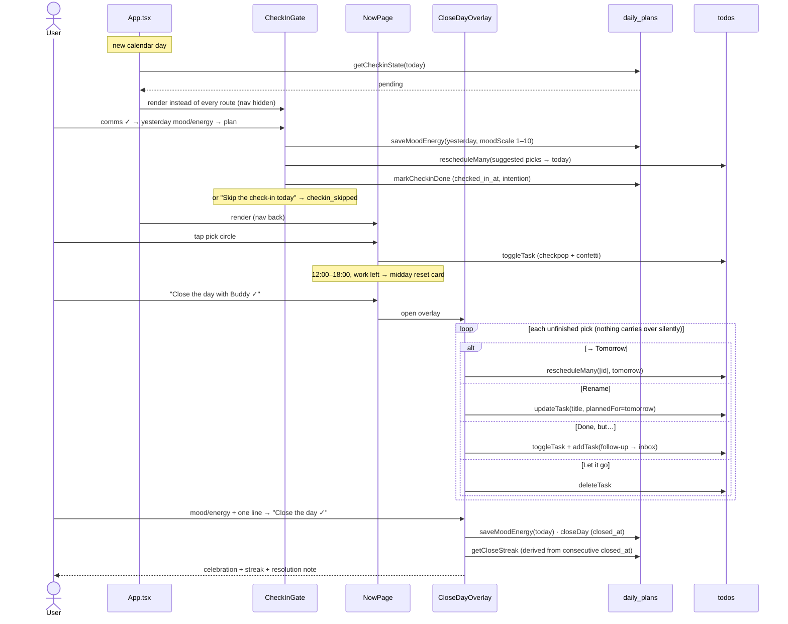
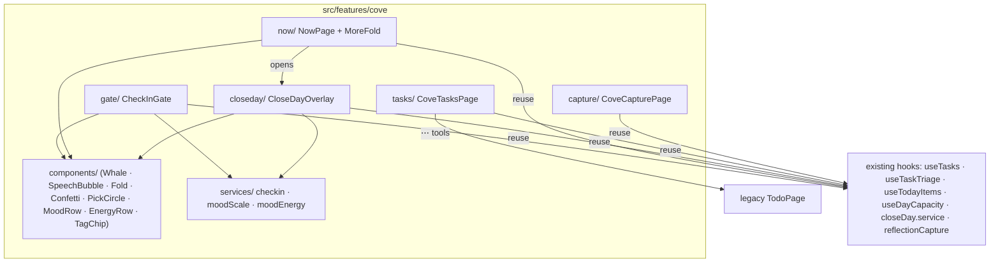

# Buddy Cove — daily loop sequence

```mermaid
sequenceDiagram
    actor U as User
    participant App as App.tsx
    participant Gate as CheckInGate
    participant Now as NowPage
    participant Close as CloseDayOverlay
    participant DP as daily_plans
    participant Todos as todos

    Note over App: new calendar day
    App->>DP: getCheckinState(today)
    DP-->>App: pending
    App->>Gate: render instead of every route (nav hidden)
    U->>Gate: comms ✓ → yesterday mood/energy → plan
    Gate->>DP: saveMoodEnergy(yesterday, moodScale 1–10)
    Gate->>Todos: rescheduleMany(suggested picks → today)
    Gate->>DP: markCheckinDone (checked_in_at, intention)
    Note over Gate: or "Skip the check-in today" → checkin_skipped

    App->>Now: render (nav back)
    U->>Now: tap pick circle
    Now->>Todos: toggleTask (checkpop + confetti)
    Note over Now: 12:00–18:00, work left → midday reset card

    U->>Now: "Close the day with Buddy ✓"
    Now->>Close: open overlay
    loop each unfinished pick (nothing carries over silently)
        alt → Tomorrow
            Close->>Todos: rescheduleMany([id], tomorrow)
        else Rename
            Close->>Todos: updateTask(title, plannedFor=tomorrow)
        else Done, but…
            Close->>Todos: toggleTask + addTask(follow-up → inbox)
        else Let it go
            Close->>Todos: deleteTask
        end
    end
    U->>Close: mood/energy + one line → "Close the day ✓"
    Close->>DP: saveMoodEnergy(today) · closeDay (closed_at)
    Close->>DP: getCloseStreak (derived from consecutive closed_at)
    Close-->>U: celebration + streak + resolution note
```

Component map:

```mermaid
graph TD
    subgraph cove["src/features/cove"]
        P["components/ (Whale · SpeechBubble · Fold · Confetti · PickCircle · MoodRow · EnergyRow · TagChip)"]
        G["gate/ CheckInGate"]
        N["now/ NowPage + MoreFold"]
        C["closeday/ CloseDayOverlay"]
        T["tasks/ CoveTasksPage"]
        Cap["capture/ CoveCapturePage"]
        S["services/ checkin · moodScale · moodEnergy"]
    end
    G & N & C --> P
    G & C --> S
    N -->|opens| C
    T -->|"⋯ tools"| Legacy["legacy TodoPage"]
    G & N & C & T & Cap -->|reuse| Domain["existing hooks: useTasks · useTaskTriage · useTodayItems · useDayCapacity · closeDay.service · reflectionCapture"]
```
