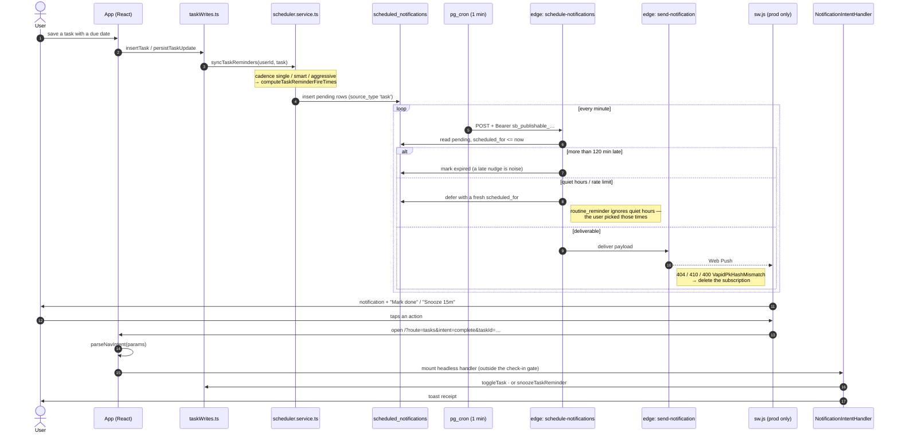
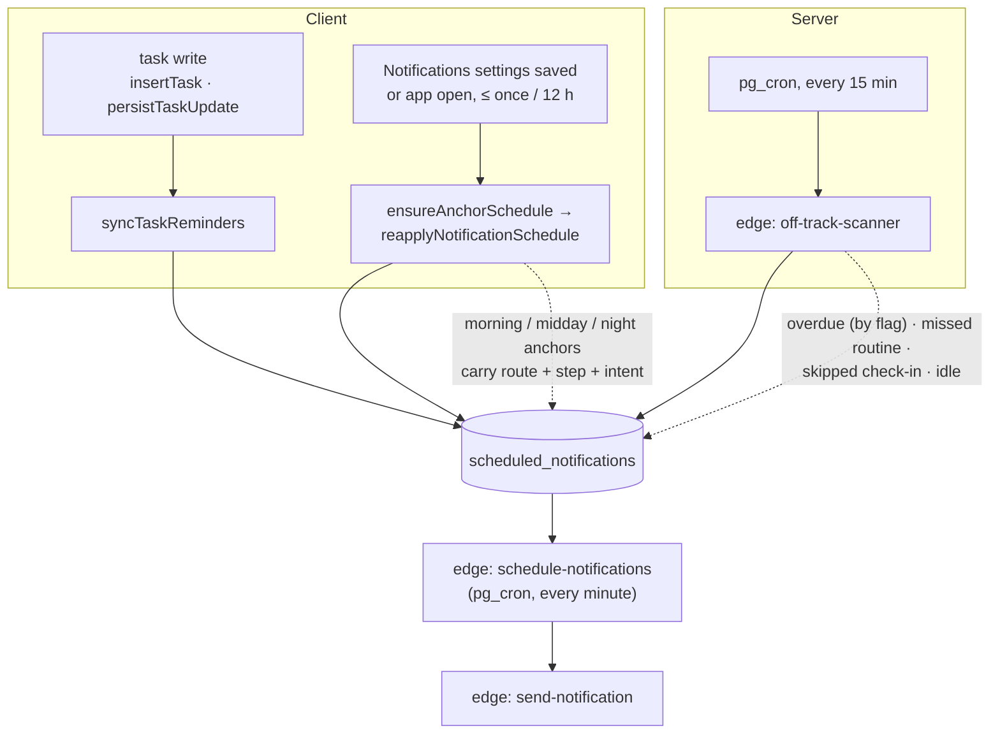

# Notifications — diagrams

Companion to [../notifications.md](../notifications.md).

## 1. The full lifecycle of one task reminder

From the write that creates it to the tap that acts on it. Everything below
`scheduled_notifications` is server-side and runs whether or not the app is open.

## 2. Where reminder rows come from

Three independent producers write into the same table. Only the first is tied
to a user action.

