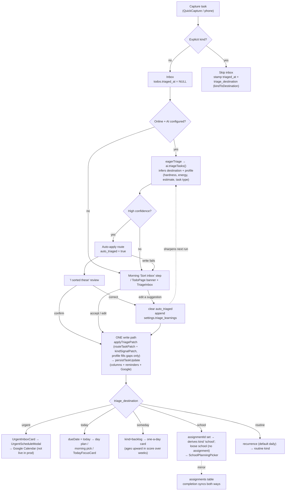
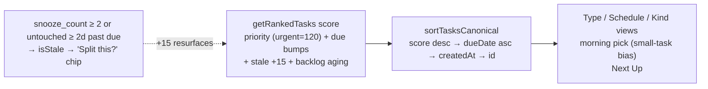

# Tasks capture-triage — flow diagram

How a captured task moves from the inbox to its destination, through the single
write path shared by every routing route. See [../tasks.md](../tasks.md).

## Ordering & stuck signals (all list surfaces)

