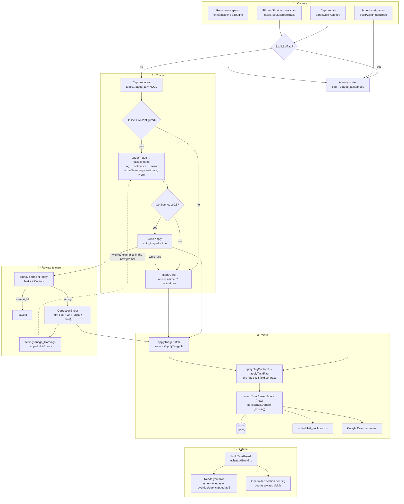

# Tasks capture-triage — flow diagram

How a captured task gets a flag and reaches the database, through the two write
paths every route shares. See [../tasks.md](../tasks.md) and the canonical
[`src/features/tasks/README.md`](../../src/features/tasks/README.md).

```mermaid
flowchart TD
  subgraph capture["1 · Capture"]
    App["Capture tab<br/>parseQuickCapture"]
    Edge["iPhone Shortcut / assistant<br/>tasks.tool.ts::createTask"]
    School["School assignment<br/>buildAssignmentTodo"]
    Recur["Recurrence spawn<br/>on completing a routine"]
  end

  Flagged{"Explicit #flag?"}
  App --> Flagged
  Edge --> Flagged

  Inbox["Capture inbox<br/>todos.triaged_at = NULL"]
  Sorted["Already sorted<br/>flag + triaged_at stamped"]

  Flagged -->|no| Inbox
  Flagged -->|yes| Sorted
  School --> Sorted
  Recur --> Sorted

  subgraph triage["2 · Triage"]
    Eager{"Online + AI configured?"}
    Inbox --> Eager
    Eager -->|yes| Infer["eagerTriage → task.ai.triage<br/>flag + confidence + reason<br/>+ profile (energy, estimate, type)"]
    Eager -->|no| Review

    Conf{"Confidence ≥ 0.8?"}
    Infer --> Conf
    Conf -->|yes| Auto["Auto-apply<br/>auto_triaged = true"]
    Conf -->|no| Review["TriageCard<br/>one at a time, 7 destinations"]
    Auto -->|write fails| Review
  end

  Patch["applyTriagePatch<br/>services/applyTriage.ts"]
  Auto --> Patch
  Review --> Patch
  Sorted --> Contract

  subgraph write["3 · Write"]
    Contract["applyFlagContract → applyTaskFlag<br/>the flag's full field contract"]
    Patch --> Contract
    Contract --> Persist["insertTask / insertTasks (new)<br/>persistTaskUpdate (existing)"]
    Persist --> DB[("todos")]
    Persist --> Rem["scheduled_notifications"]
    Persist --> GCal["Google Calendar mirror"]
  end

  subgraph learn["4 · Review & learn"]
    Auto --> Fold["'Buddy sorted N today'<br/>Tasks + Capture"]
    Fold -->|looks right| Done["leave it"]
    Fold -->|wrong| Fix["CorrectionSheet<br/>right flag + why (chips / note)"]
    Fix --> Doc["settings.triage_learnings<br/>capped at 40 lines"]
    Doc -.->|worked examples in the next prompt| Infer
    Fix --> Patch
  end

  subgraph surface["5 · Surface"]
    DB --> Board["buildTaskBoard<br/>utils/taskBoard.ts"]
    Board --> Now["Needs you now<br/>urgent + today + overdue/due, capped at 5"]
    Board --> Sections["One folded section per flag<br/>counts always visible"]
  end
```

## Why it is shaped this way

- **One patch builder.** Auto-applied and hand-routed tasks both go through
  `applyTriagePatch`, so an AI decision and a human decision produce byte-identical rows.
- **One contract.** `applyTaskFlag` is the only place that knows what a flag implies.
  It runs on every write, including inserts that never went through triage.
- **Two write paths, not four.** Before August 2026 the recurrence spawn and the
  routine runner each hand-rolled an insert; neither scheduled reminders, so every
  recurring task went silent after its first occurrence.
- **The correction loop closes.** A correction is only useful if it carries the
  reason, and only reachable if the auto-sorted tasks are actually shown.
