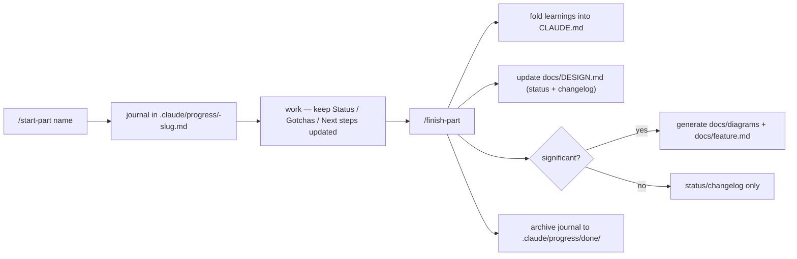

# Claude Code Setup — Agents, Commands, Hooks & Workflows

This repo ships project-specific Claude Code tooling so that working with Claude is faster, safer, and resumable. Everything lives under `.claude/` (checked into git, except local scratch) plus a few root config files.

If you're new here: read the project `CLAUDE.md` first — it holds the hard rules these tools enforce.

---

## TL;DR — the everyday flow

1. Starting a feature/task? → just start working — the **journal autostart** hook makes Claude create the progress journal automatically on the first code edit. (`/start-part <name>` still works when you want to name/scope the part yourself.)
2. Work as normal. Hooks quietly format your edits and warn about rule violations (including migration RLS/timestamp checks and the tasks-feature invariants).
3. Need the data layer or an edge function? → `/new-domain`, `/new-migration`, `/deploy-fn`, or the matching agent. The Stop hook reminds you about edge functions you edited but didn't deploy.
4. Commit whenever — the **commit gate** hook runs the typecheck automatically and blocks the commit if `tsc` fails (bypass with `--no-verify`). `/check` is now only needed for the full lint + test pass.
5. Done? → nothing to remember: once the journal's Status checklist is fully checked, the Stop hook makes Claude run the `/finish-part` folding automatically (learnings into `CLAUDE.md`, `docs/DESIGN.md` update, UML/docs if the change was big, journal archived). `/finish-part` still exists for finishing manually/early.

---

## 1. Hooks (automatic, advisory)

Configured in `.claude/settings.json`; scripts live in `.claude/hooks/`. **All hooks are advisory except the commit gate** (the one place a hard stop is worth it). Node-based, so they work on Windows/PowerShell and macOS/Linux alike. All are **silent when everything is clean** — they only inject context on an actual problem, so their token cost is near zero.

| Hook | When | What it does |
|---|---|---|
| `pre-commit-gate.mjs` | before any `git commit` (Bash or PowerShell) | Runs `npx tsc -b` automatically. Clean → commit proceeds silently. Errors → the commit is **blocked** and the errors are fed back to Claude to fix. Bypass with `--no-verify`. Lint/tests deliberately excluded (slow; lint baseline isn't clean) — use `/check` for those. |
| `quality-guard.mjs` | after every Edit/Write/MultiEdit | Warns (to Claude) if the edit introduces `any`, `console.log` in `src/`, the `tracker_entries` / `from('tasks')` naming gotchas, or raw locale date formatting. Also enforces the **tasks-feature invariants** (`new Date('YYYY-MM-DD')` on due dates, direct `todos` writes outside the canonical write path, writing the derived-only `school` kind) and validates **migrations** (`create table` without RLS, timestamp not sorting after the latest migration). Scans code/SQL only — skips docs & markdown. |
| `format-edited.mjs` | after every Edit/Write/MultiEdit | Runs Prettier on just the file that changed. No-ops silently if Prettier isn't installed. |
| `journal-autostart.mjs` | after every Edit/Write/MultiEdit | Automates `/start-part`: the first time code is edited (`src/` or `supabase/`) in a session with **no active journal**, it instructs Claude to create the part journal itself and keep it updated — once per session, silent otherwise. Trivial one-off fixes are allowed to skip. |
| `stop-audit.mjs` | when a session ends | Scans git-changed `src/` files for leftover `console.log` / `any` / `tracker_entries`. Also reminds about **edge functions edited but not deployed** (`/deploy-fn <name>`) and nudges when `src/` changed but the journal hasn't been updated in >2h. **Auto-finish:** if the active journal's Status checklist is fully checked, it holds the stop once and makes Claude perform the whole `/finish-part` folding (learnings → `CLAUDE.md`, `docs/DESIGN.md`, docs/diagrams if significant, archive) automatically. |
| `resume-context.mjs` | at session start | Lists any unfinished progress journals (`.claude/progress/`) with their Status + Next steps so you can pick up where you left off. |

**Why mostly advisory?** With a known lint baseline, hard blocks would create friction. These nudge Claude to self-correct without stopping work. The exception is the commit gate: the tsc baseline *is* clean, so a tsc failure is always a real regression — blocking there is cheap and safe.

---

## 1b. Recommended permissions allowlist (optional, reduces prompts)

Claude can't grant itself standing permissions, so this is a one-time manual paste. Add a `permissions` block to `.claude/settings.json` (next to `hooks`) to make routine read-only/tooling commands run without approval prompts. Mutating operations (`db push`, `functions deploy`, `git push`, `apply_migration`) intentionally stay prompt-gated.

```json
"permissions": {
  "allow": [
    "Bash(npm run:*)", "Bash(npx tsc:*)", "Bash(npx vitest:*)",
    "Bash(npx prettier:*)", "Bash(npx eslint:*)",
    "Bash(git status:*)", "Bash(git diff:*)", "Bash(git log:*)",
    "Bash(git add:*)", "Bash(date:*)",
    "PowerShell(npm run *)", "PowerShell(npx tsc *)", "PowerShell(npx vitest *)",
    "PowerShell(npx prettier *)", "PowerShell(npx eslint *)",
    "PowerShell(git status *)", "PowerShell(git diff *)", "PowerShell(git log *)",
    "mcp__postgres__query",
    "mcp__claude_ai_Supabase__list_tables", "mcp__claude_ai_Supabase__list_migrations",
    "mcp__claude_ai_Supabase__list_edge_functions", "mcp__claude_ai_Supabase__get_edge_function",
    "mcp__claude_ai_Supabase__get_logs", "mcp__claude_ai_Supabase__get_advisors",
    "mcp__claude_ai_Supabase__get_project_url"
  ]
}
```

---

## 2. Agents (`.claude/agents/`)

Specialized subagents that encode this project's patterns. Claude invokes them automatically when relevant, or you can ask for one by name.

| Agent | Use it for |
|---|---|
| `supabase-domain` | Scaffolding a **new data domain** end-to-end: `Db<X>` row type → converter (`dbToX`/`xToDb`) → both barrel re-exports → a timestamped migration. Mirrors `src/services/supabase/converters/todo.ts`. |
| `edge-fn` | Building/editing **Supabase edge functions** (Deno): `_shared/` helpers, service-role + explicit `userId` filtering, pg_cron awareness, deploy steps. |
| `pwa-reviewer` | **Reviewing your diff** against the project hard rules (no `any`, naming gotchas, immutability, boundary validation, no `console.log` in `src/`, date-fns, feature-module layout). Read-only. |
| `vitest-author` | Writing **Vitest tests** in the existing style (globals on, jsdom, `*.test.ts` beside code). Prioritizes converters, parsers, calculations, rule engine. |

---

## 3. Slash commands (`.claude/commands/`)

| Command | Args | What it does |
|---|---|---|
| `/check` | — | Runs `npm run lint`, `tsc -b`, `npm run test:run`; reports only the failures + a commit-safe verdict. |
| `/new-domain` | `<Name> [fields]` | Delegates to `supabase-domain` to scaffold a new data domain. |
| `/new-migration` | `<description>` | Creates `supabase/migrations/<UTC-timestamp>_<slug>.sql` with an RLS-enabled skeleton. Does **not** apply it. |
| `/deploy-fn` | `<function-name>` | Deploys an edge function (`--project-ref kdwgznfszbrysepsltua`) and checks logs/advisors via the Supabase MCP. |
| `/db` | `<question>` | Answers questions about the **live** schema/data via the Supabase/postgres MCP (read-only). |
| `/start-part` | `<part name>` | Starts or resumes a progress journal. |
| `/finish-part` | `[part name]` | Closes out a part (see workflow below). |

---

## 4. Progress journal workflow (resumable work)

The "part" workflow keeps multi-step work organized and survivable across sessions.



- **Journals are gitignored** (`.claude/progress/`) — they're local scratch, not committed. They persist on disk so a fresh session can resume; the `resume-context` hook surfaces them automatically at startup.
- **Template:** `.claude/templates/progress.md` — sections for Goal, Status checklist, Key context/decisions, Errors & gotchas, Next steps, and **Candidate learnings for CLAUDE.md**.
- **`/finish-part` "significance" rule** — it auto-generates a Mermaid diagram (`docs/diagrams/<feature>.md`) and a feature page (`docs/<feature>.md`) only when the part added a new feature module, a new Supabase domain/table/migration, a new edge function, or touched ~8+ files. Small parts only bump the status + changelog — no doc churn.

`docs/DESIGN.md` is the **living status/architecture overview** — what's Done vs Planned, the top-level architecture diagram, the changelog, and an index of generated feature docs.

---

## 5. Formatting & pre-commit

- **Prettier** is configured in `.prettierrc.json` (single quotes, 4-space indent, semicolons, width 100). Ignore rules in `.prettierignore`.
  - `npm run format` — format the whole repo.
  - `npm run format:check` — check without writing (CI-friendly).
- **husky + lint-staged** — `.husky/pre-commit` runs `lint-staged` on **staged files only**: Prettier on `*.{ts,tsx,js,jsx,mjs,cjs,json,css}` and `eslint --fix` on `*.{ts,tsx}`. Because it's scoped to staged files, the existing lint baseline in untouched files never blocks a commit.
  - `tsc` is intentionally **not** in pre-commit (whole-project, too slow) — use `/check` and/or CI for that.

> First-time setup on a fresh clone: `npm install` runs the `prepare` script, which initializes husky automatically. No manual step needed.

---

## 6. File map

```
.claude/
  settings.json            # hook wiring (shared)
  settings.local.json      # personal permissions allowlist (not part of this setup)
  hooks/
    pre-commit-gate.mjs
    quality-guard.mjs
    journal-autostart.mjs
    format-edited.mjs
    stop-audit.mjs
    resume-context.mjs
  agents/
    supabase-domain.md  edge-fn.md  pwa-reviewer.md  vitest-author.md
  commands/
    check.md  new-domain.md  new-migration.md  deploy-fn.md  db.md
    start-part.md  finish-part.md
  templates/
    progress.md
  progress/                # gitignored local journals (created on demand)
.prettierrc.json  .prettierignore
.husky/pre-commit
docs/DESIGN.md             # living status/architecture doc
```

---

## 7. Troubleshooting

- **Hooks aren't running** — they're defined in `.claude/settings.json`; restart the Claude Code session after changing it. Hooks need `node` on PATH (Node 24 in this project).
- **Commit blocked by the gate but you must commit anyway** — add `--no-verify` to the `git commit` command; the gate (and husky) skip it. Use sparingly.
- **Commit gate feels slow** — it runs `tsc -b` (incremental) only on `git commit`, never on ordinary commands. ~5–15s warm; the first run after a clean checkout is slower.
- **Prettier reformats too much** — adjust `.prettierrc.json` or add paths to `.prettierignore`. The format-on-edit hook only touches the single file you edited.
- **A commit is blocked by eslint** — lint-staged only gates the files you staged. Fix the reported issues, or stage fewer files. (It does not enforce the whole-repo baseline.)
- **Quality-guard warned on a doc that describes a rule** — it only scans `.ts/.tsx/.js/.jsx/.mjs/.cjs/.sql`; markdown is skipped, so this shouldn't happen. If it does, the file extension is likely code.
- **Resume hook didn't surface a journal** — confirm the file is in `.claude/progress/` and ends in `.md`. The folder is gitignored by design.

---

_Maintained as part of the repo's developer tooling. When you change the hooks/agents/commands, update this doc (and `CLAUDE.md`’s "Claude Code helpers" section)._
